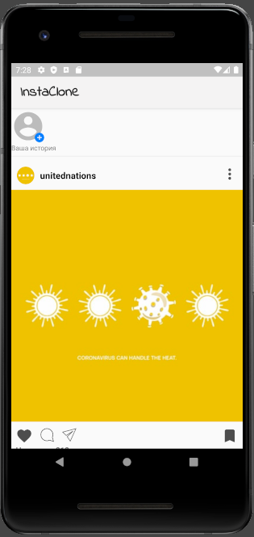

# Instaclone 

This is a toy app for a test assignment 

## A clone of Instagram Android app

This app displays a list of posts with images in a RecyclerView. Posts come from Unsplash Api with help of Retrofit library and Moshi library.
Images are displayed using Glide.
App is build upon a toy app from Udacity lesson on Android.

## Screenshots

